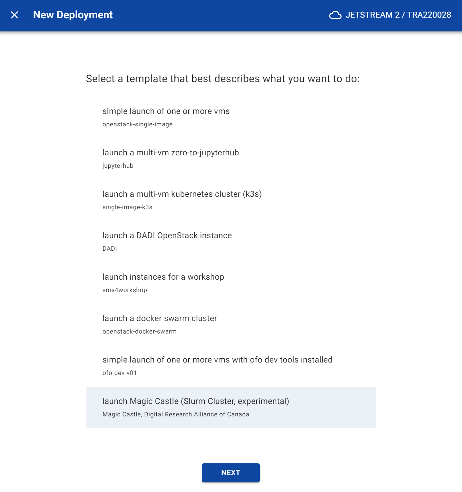
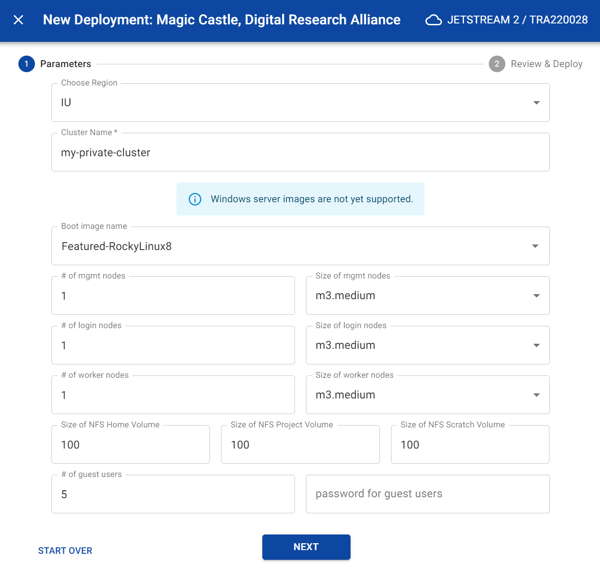
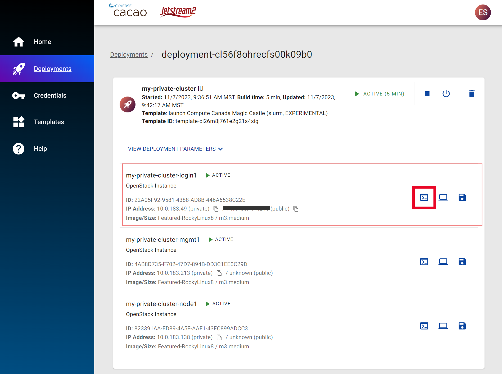
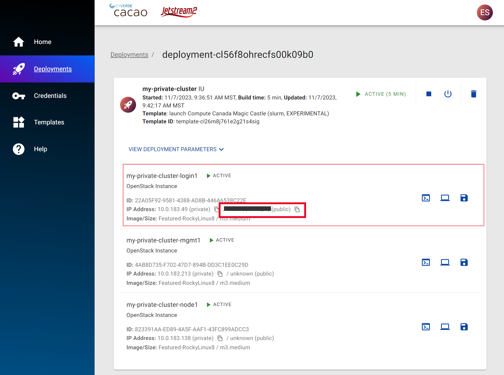
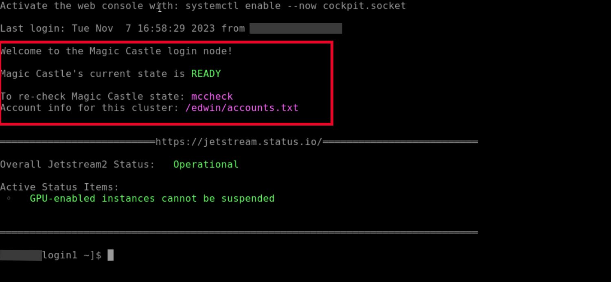

# Deploying Single/Multiple VMs

[Magic Castle](https://docs.computecanada.ca/wiki/Magic_Castle), developed by the Digital Research Alliance of Canada (formerly Compute Canada), is a terraform template to deploy a virtual slurm cluster. This template has been adapted to launch easily in CACAO.

## Pre-requisites

You will need to setup your the following before you deploy any cloud resource using CACAO:

- Jetstream cloud credentials (aka application credential)
- your public ssh key

Instructions on installing your first Jetstream cloud credential and adding  in CACAO can be found [here](https://docs.jetstream-cloud.org/ui/cacao/credentials/).

Magic Castle requires several OpenStack resources, which may impact your quota limits. Here is a summary on minimum resources:

- 1 floating IP
- 3 security groups
- 1 network
- 1 subnet
- 1 router
- 3 volumes
- 3 instances
- 8 VCPUs
- 7 neutron ports
- 12 GB of RAM
- 8 security rules
- 80 GB of volume storage

See [this page for more information on this limits](https://github.com/ComputeCanada/magic_castle/tree/main/docs#144-openstack). You may need to request a quota increase from Jetstream2 staff if you do not have enough quota.

## Instructions

The steps below will guide you through the process of deploying a Magic Castle (virtual slurm cluster)

1. Go to Deployments menu in CACAO
2. If you have more than one ACCESS allocation, you should select the ACCESS project in the left drop down menu.
3. Select "Add Deployment" from the top right corner.
4. Click on **launch Compute Canada Magic Castle** from the list of available templates. You may need to scroll down to find it.

{ width="50%" }

5. Click the Next button
6. In the dialog:
    1. Choose your Region
    2. Give a Cluster Name
    3. Select a Boot Image
    ***_NOTE:_*** You must select either AlmaLinux 8/9 or Rocky 8/9 image
    4. Management Nodes: select the number and size of your management node(s)
    5. Login Nodes: select the number and size of your login nodes  
    6. Worker Nodes: select the number and size of your compute nodes
    7. Select the number of guest users
    ***_NOTE:*** Guest users will be named `user1`, `user2`, etc
    8. Enter a guest user shared password
    ***_Note:*** All guest users will use the same password. If left blank, a random password will be generated (see below)

{ width="50%" }

7. Click the Next button
8. After reviewing the parameters, click the "Submit" button
9. Get a cup of coffee and wait for the deployment to complete. You can monitor the progress of the deployment in the "Deployments" menu.

## Accessing your Magic Castle Cluster as the "Sudo" user

When your cluster is ready, you have two options to access the cluster as an "sudo" user, the account with elevated privileges.

### Option 1: Web Shell

1. In the Deployments list, click on your deployment
2. Click on the "Web Shell" button for the login node (see image)

{ width="50%" }

### Option 2: Using an SSH Client

1. In the Deployments list, click on your deployment
2. Copy the public ip address for the login node (see image)
3. Using an external ssh client loading with the private key that matches one of the public keys uploaded to CACAO, goto: `<username>@<public-ip-address>`. For example, if your access ci identity is `wildcat@access-ci.org` and the public ip is 1.2.3.4, then your ssh login to the login node will be `wildcat@1.2.3.4`.
{ width="50%" }

## Verifying that your Magic Castle Cluster is ready to use

1. When you web shell or ssh into your Magic Castle Cluster login node, you should see a message similar to screenshot below.
{ width="50%" }
2. You should see the following information:
    1. The current status of your Magic Castle cluster. It should be "Ready" when ready.
    2. The command if you need to re-check the Magic Castle Cluster, `mccheck`.
    3. The path to the `accounts.txt file that contains both the number of guest users and shared guest user password.

## Giving access to your Guest Users

Guest users can access the Magic Castle cluster using an ssh client. The guest user accounts are autogenerated (e.g. `user1`, `user2`, etc) and will use the same password. The password is stored in the `accounts.txt` file in the home directory of the "sudo" user.