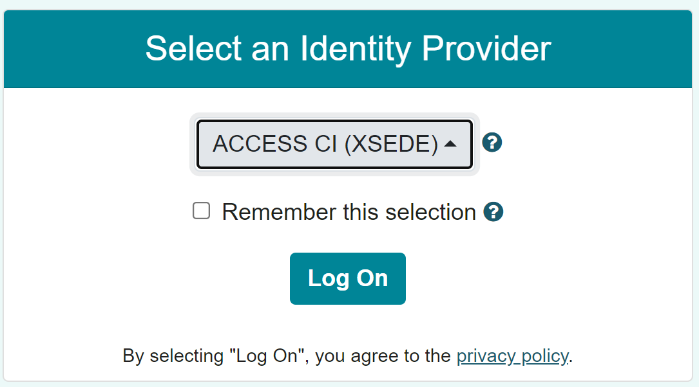
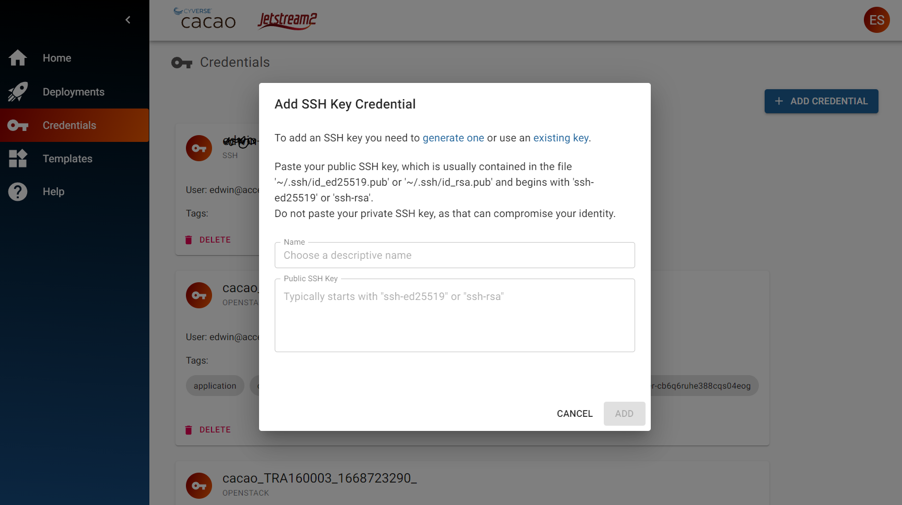
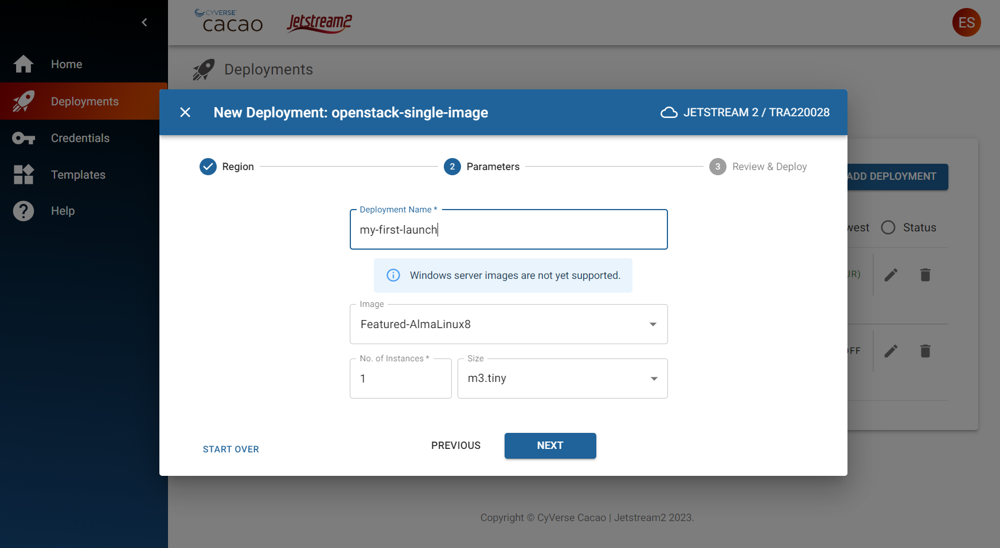

{ width=128px }[CACAO Overview](overview.md) &gg; Getting started for new users

# Getting started for new users

CACAO is a space for you to organize and manage your Jetstream cloud resources. Once you obtain your Jetstream allocation, this guide will help you get started.

## 1. Login to CACAO

CACAO uses Globus XSEDE credentials for identity

!!! cacao-steps ""

    1. In your browser, connect to [https://cacao.jetstream-cloud.org](https://cacao.jetstream-cloud.org)
    2. Click Sign-In button.
    3. If you are not currently logged into ACCESS, you should select the "ACCESS-CI (XSEDE)" identity provider
    4. Enter your ACCESS login credentials
    5. You may need to authenticate with your two-factor
    6. Upon successful login, you will land into the CACAO dashboard

    { width="75%" }

## 1. Add your Jetstream 2 credentials

Access to any Jetstream 2 cloud will begin with adding the OpenStack Application Credentials for your ACCESS project/allocation.

!!! cacao-steps ""
    1. Click on the Credentials menu
    2. Click on Add Credential button
    3. Select Cloud Credential
    4. Select Jetstream 2
    5. Click Next
    6. Select the ACCESS allocation that you wish to import into CACAO (if you belong to multiple allocations, you can select multiple allocations)
    8. Click on the Add button

    { width="75%" }

## Add a Public SSH Key

SSH Keys are used to login to virtual machines (sometimes called 'servers' or 'instances') after they are launched.

!!! cacao-steps ""
    1. Click on the Credentials menu
    2. Click on the Add Credential button
    3. Select Public SSH Key
    4. Enter a name for your public ssh key
    5. Paste in your public ssh key
    6. Click on the Add button

    { width="75%" }
## 2. Create your first workspace

You can use Workspaces to organize your deployments.

!!! cacao-steps ""
    1. Click on the Deployments menu
    2. Click on the Add Workspace button
    3. Enter your Workspace name
    4. Enter a Description
    5. Enter a Default Cloud, which is used to deploy your resources
    6. Click on the Create Workspace Button

    { width="75%" }

## 3. Create your first deployment

!!! cacao-steps ""
    1. Click on the Deployments menu
    2. Click on the Add Deployment button
    3. Select Workspace, then Next button
    4. Select the "openstack-single-image-new" Template, then Next Button
    5. Select your Openstack credential, then wait a few seconds for the project list to be retrieved
    6. Select your Openstack project to launch your deployment
    7. Enter your deployment values
       A. Deployment name
       B. Select your image
       C. Number of instances
       D. Size (also called 'flavor')
    8. Click Next button
    9. Review the deployment settings, then click Submit button

    { width="75%" }

## 4. Learn about other CACAO features
