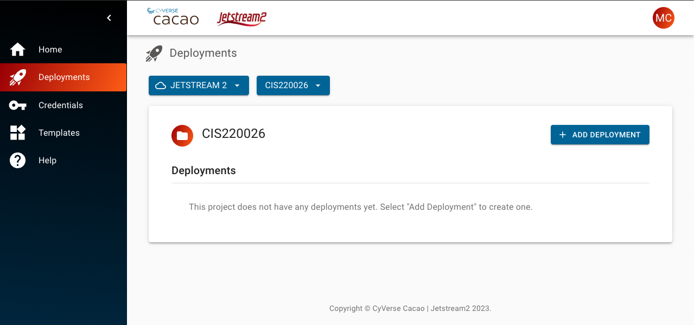
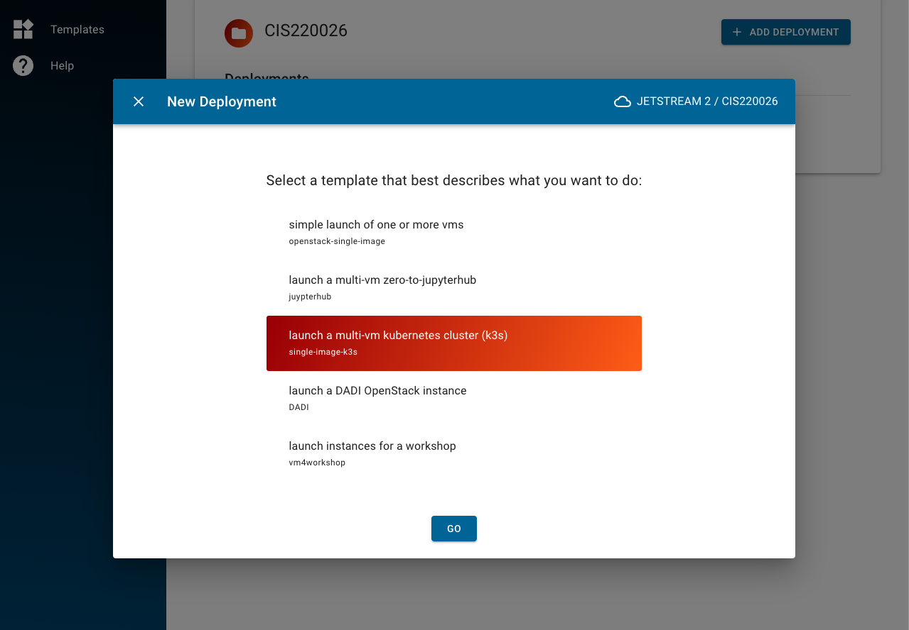
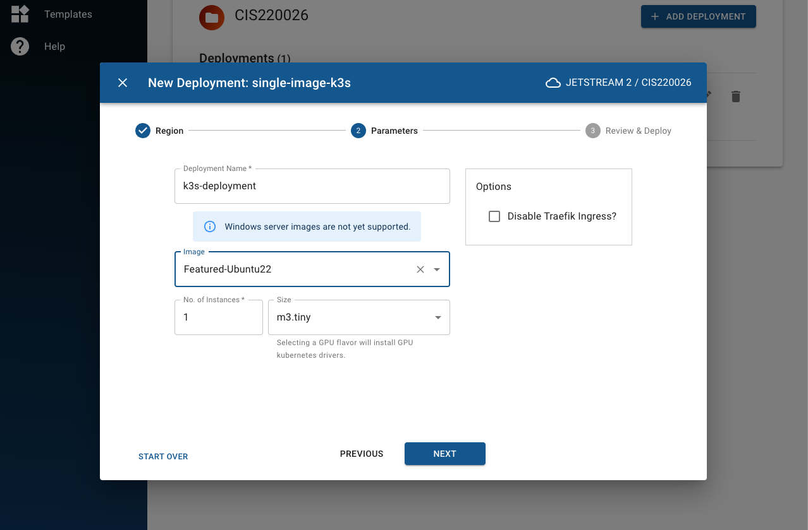
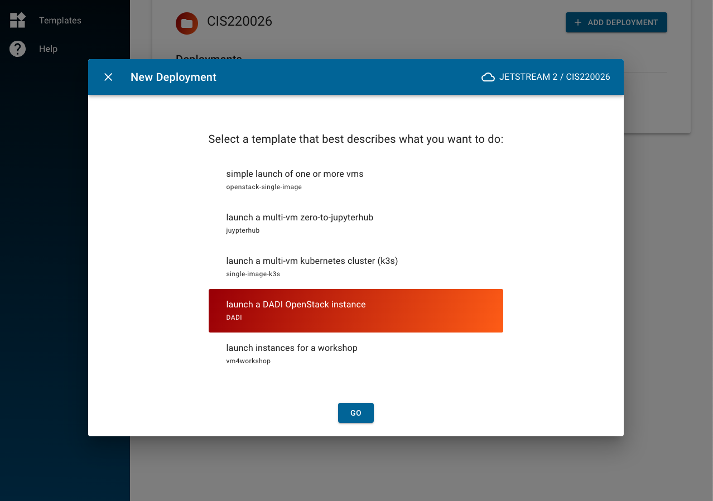
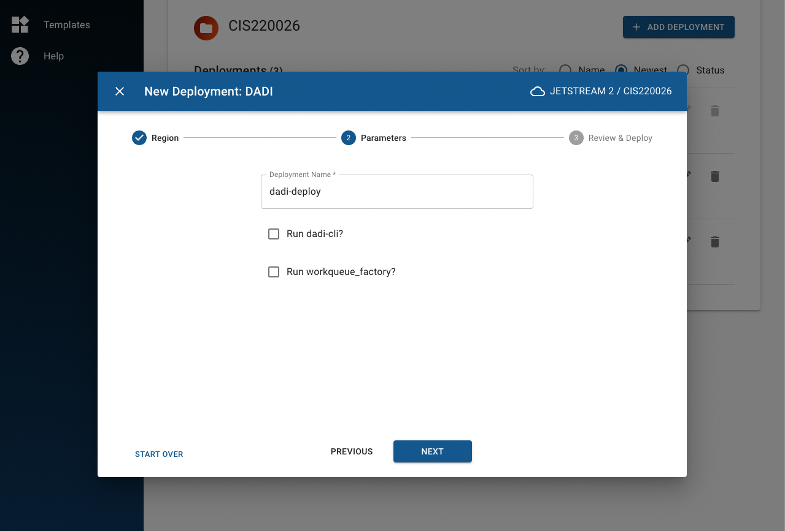
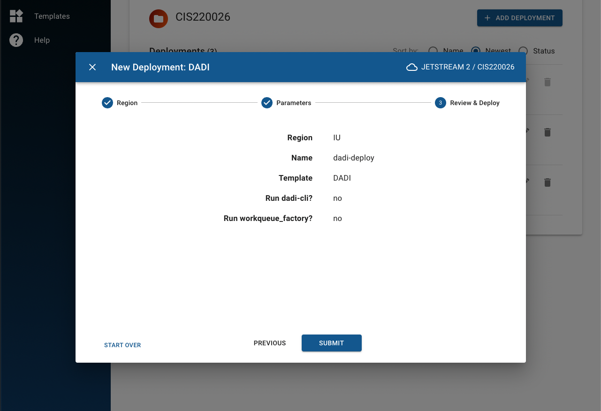
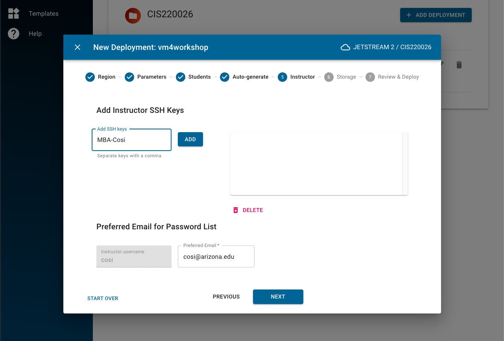
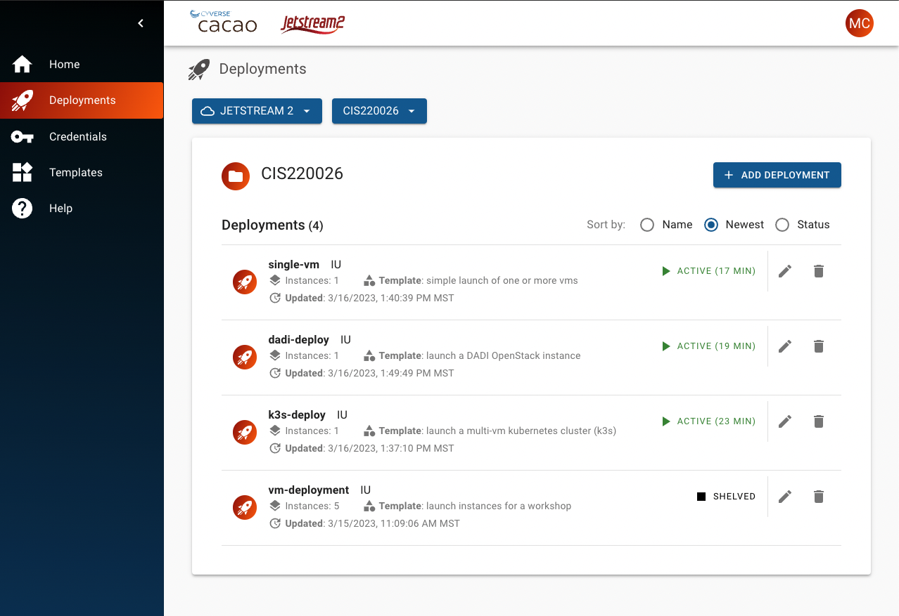

{ width=128px }[Cacao Overview](overview.md) &gg; CACAO Tutorials

# Tutorial deployments with CACAO

In this section we look at tutoral deployments to help you quickly deploy your Virtual Machines, Jupyter Labs or Kubernetes clusters in just a few clicks.

If you would like to know more about the available templates and deployments in CACAO, here are some useful links:

- [Templates](templates.md): learn about the available CACAO templates and template management.
- [Deployments](deployments.md): learn about deployments with the CACAO UI.

Page contents:

- [Deploying Single/Multiple VMs](#deploying-singlemultiple-vms)
- [Deploying Multi-VM JupyterHub](#deploying-multi-vm-jupyterhub)
- [Deploying Multi-VM Kubernetes Cluster](#deploying-multi-vm-kubernetes-cluster)
- [Deploying DADI OpenStack Instace](#deploying-dadi-openstack-instace)
- [Accessing your deployments](#accessing-your-deployments)

---

Each template is engineered to make deployment simple and accessible with a few clicks of your mouse. Although the deployment process is similar for all of the templates, here are some step-by-step tutorials on how to deploy from each template.

To begin deploying, navigate from your Home screen to the deployment page by selecting Deployments on the left hand side. An empty Deployment page looks like the following.

Notice how there are no deployments, but the user has already added credientials for Clouds (`JETSTREAM2`) and Projects (the serial number following the Clouds button). Adding credentials is necessary in order to continue with deployments. If you have not added your credentials, read how to [here](credentials.md).

## Deploying Single/Multiple VMs

From the deployment screen, select **simple launch of one or more vms**

This will open a small window, which will ask you which region you'd like to deploy onto (more regions are to be deployed in the future, for now 'IU' is the only option). Clicking **Next** will open the Parameters window. Give the deployment a descriptive name, and select the image you'd like to deply from. In this example, we choose the base **Featured-Ubuntu22** image. You can also select the amount of instances you want to create (in the example, we only create one), and the [size](https://docs.jetstream-cloud.org/general/vmsizes/) of deployment.

Clicking next, will open the summary window prior to launch. To deploy, click **Submit**.

The VM should be successfully launched after a few minutes of building. You can access the VM by either:

1. clicking on the small Console button;
2. clicking on the PC button;
3. Through `ssh` (assuming you already have added your credentials)

## Deploying Multi-VM JupyterHub

**_Coming Soon_**

## Deploying Multi-VM Kubernetes Cluster

**_Under review_**

From the deployment screen, select **launch a multi-vm kubernetes cluster (k3s)**

Select the region, add add a deployment name. Select the image you want to use with your deployment, alongside number of instances and size. Select wether to disable [Traefik Ingress](https://doc.traefik.io/traefik/providers/kubernetes-ingress/) for your work.

Review the summary and launch.

## Deploying DADI OpenStack Instace

**_Under review_**

From the deployment screen, select **launch a DADI OpenStack instance**

Select the region, and add a deployment name. You can also choose to run `dadi-cli` or `workqueue_factory`.

Review the summary and launch.

## Deploying Multiple VMs for workshops

From the deployment screen, select **launch instances for a workshop**

After selecting your region, the next step is to set parameters: give a descriptive name, select the deployment image and size, number of learners and instructors, and spare VMs (optional).

The next step is to set the usernames. This can be done manually through the left hand writable field (add with commas and spaces) or by uploading a CSV file. Clicking **ADD** (or **UPLOAD** if using a CSV) will show the added usernames on the right hand field. The "Added Usernames" field can be used to remove unwanted usernames.

After adding usernames, instructors are able to add their SSH key. You can only use ssh keys that have already been added to the Credentials -- read how to [here](https://docs.jetstream-cloud.org/ui/cacao/credentials/#adding-an-ssh-public-key), or how to create an ssh key [here](https://www.ssh.com/academy/ssh/keygen).

You can set a shared storage space as well. This shared storage will be visible and accessible through all the VMs that have been deployed through this method. Lastly, review your deployment and click submit to launch.

The launched screen looks like the following screenshot:

Upon launch, the instructor will receive a list of passwords and IP addresses that the users can use in order to connect via `ssh` from their own computers.

## Accessing your deployments

You can access each of your deployments by clicking on the **Deployments** button on the left hand menu. You can then select the deployment of your choice. The following screenshot example shows 3 successfully running deployments and a [shelved one](https://docs.jetstream-cloud.org/general/instancemgt/#shelve-and-unshelve) (each of them is accessbile by clicking on it for extra information).

