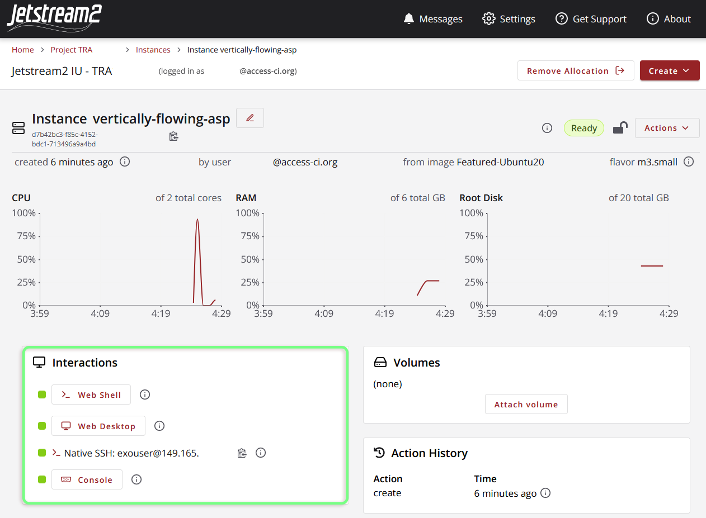

# Accessing an Exosphere Instance

## The exouser Profile & Passphrase

Instances launched with Exosphere will be created with a user `exouser`. By default, `exouser` has `sudo` privilege, and any web shells/desktops launched from Exosphere will be signed in with this account. Should you ever need the initial password/passphrase created for `exouser`, it can be found on the individual Exosphere page for your instance under "Credentials."


---

## Accessing an Instance through Exosphere Web Interface

Exosphere provides a variety of different methods for interacting with your instances, depending on the options selected during creation. These options include the web shell, web desktop, and console, all of which can be accessed either from the Exosphere *Instances* page (with the "Connect to" dropdown) or from the *Interactions* section of your instance's main page. 

Remember that the web shell and web desktop will not be available if you have chosen not to assign a public IP address to your instance!
{: .note}

| "Instances" Page | Individual Instance Page |
|---------|---------|
|  | |

### Web Shell (Guacamole)

By default, Exosphere configures all new instances with an easy-access web shell via [Guacamole](https://guacamole.apache.org/). This command-line interface signs in as `exouser`, and thus has `sudo` access. 

***Tip***: From the web shell, you can open/close a menu overlay with `ctrl`+`alt`+`shift`. This menu supports directly uploading files to your instance, as well as sharing clipboard data.
{: .note}

### Web Desktop (Guacamole)

If an instance was [configured with Web Desktop](../create_instance/#configure-instance) enabled, Exosphere will provide an interactive [GNOME](https://www.gnome.org/) desktop environment for you to work in. Like the web shell, this is powered by [Guacamole](https://guacamole.apache.org/) and signs in as `exouser`. 

### Console

The Exosphere console is usually only used in rare circumstances, and is more akin to plugging a monitor, keyboard, and mouse into the machine than accessing it via the web shell. When using the console, you will not be signed into the machine automatically, so you will likely need to reference the `exouser` passphrase (see above).

---

## Accessing an Instance with Native SSH

If your instance does not have a public IP address assigned to it, you will be unable to SSH from your workstation (or anywhere else outside of Jetstream2, unless you are using another instance that *does* have a public ip as a tunnel point or jump host).
{: .note}

Exosphere instances support SSH connections with both password and [public key](https://kb.iu.edu/d/aews) authentication. SSH clients are almost always packaged in with operating systems by default. MacOS users can SSH from the Terminal app, and practically every Unix/Linux system has command-line SSH support. Windows 11 and Windows 10 (build 1809 and later) have a standard SSH client accessible in the Command Prompt and Powershell, although you may need to [enable it in the settings](https://learn.microsoft.com/en-us/windows-server/administration/openssh/openssh_install_firstuse?tabs=gui). If your Windows version is too old, or you want a more customizable environment, these resources may be useful:

- [PuTTY](https://learn.microsoft.com/en-us/windows-server/administration/openssh/openssh_install_firstuse?tabs=gui), a free SSH client and `xterm` terminal emulator for Windows and Unix.
- [Install Linux on Windows with WSL](https://learn.microsoft.com/en-us/windows/wsl/install)

### SSH Password Authentication

Password authentication is enabled on Exosphere-created instances by default. To connect to your instance, simply execute (where `<PUBLIC_IP>` is replaced with your instance's public ip address, e.g. `149.165.0.0`)
```
ssh exouser@<PUBLIC_IP>
```
then enter the `exouser` passphrase when prompted.

If you want to force password authentication, but are being prompted for a public key (or password for your public key), you can instead try
```
ssh -o PreferredAuthentications=password -o PubkeyAuthentication=no exouser@<PUBLIC_IP>
```

### SSH Public Key Authentication

This guide assumes that you have already generated a public/private key pair. For step-by-step instructions on doing so, see [the IU Knowledge Base](https://kb.iu.edu/d/aews).
{: .note}

Public key authentication is preferred to passwords by many. Adding your public key to an instance with the Exosphere UI is only possible [during creation](../create_instance/#advanced-options); however, there is a workaround.

#### Adding a Public Key Manually

1. Access your instance's web shell or console
2. Open up the file `~/.ssh/"authorized keys"` in the editor of your choice, for example:
    ```
    vim ~/.ssh/"authorized keys"
    ```
3. Paste your **public** SSH key into the file (**never share your private keys**) by copying it into the clipboard on your workstation, then right-clicking on the web shell. If you are having trouble copying/pasting, see [Exosphere Troubleshooting](../troubleshooting/#i-cant-copy-and-paste-tofrom-the-web-shell-or-web-desktop-guacamole). If the file is not empty, simply put your key on a new line.
4. Save and close the file.

#### Using a public key

Once your public key is registered on your instance, you should be able to SSH by referencing the **private** key file with
```
ssh -i /path/to/key/file exouser@<PUBLIC_IP>
```
Usually this will look something like
```
ssh -i ~/.ssh/id_rsa exouser@149.165.0.0
```