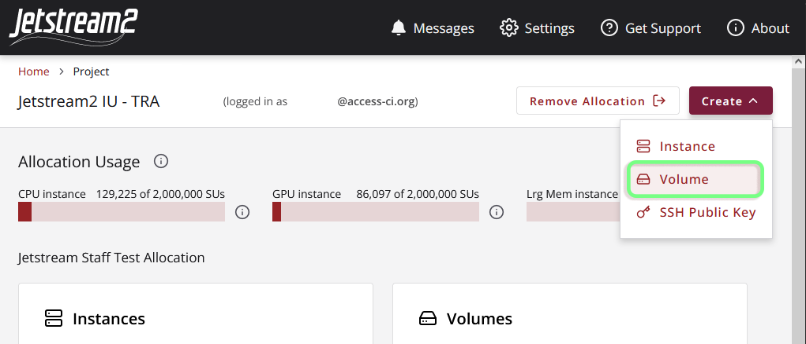

# Using Storage Under Exosphere

## Volumes

For a more robust overview of volumes on Jetstream2, please see [this article on storage](../../general/storage.md)
{: .note}

### Creating a Volume

Volumes can be created in the Exosphere interface under the "Create" dropdown (top-right):

### Attaching your Volume to an Instance

Volumes can be attached from either the *Volumes* section of the Instance Details page, the Volumes List page, or the individual Volume Details page. 

| Page             | Location                                                                                                                                               |
|------------------|--------------------------------------------------------------------------------------------------------------------------------------------------------|
| Instance Details |   |
| Volumes List     |                      |
| Volume Details   |                 |

### Accessing an Attached Volume

After successfully attaching a volume to an instance, Exosphere will display the device location (`/dev/sdb`, `/dev/sdc`, etc.) and the mount point (`/media/volume/...`) to which the volume is attached. This information can also be found on your Instance Details page or Volume Details page. 

The mount point is the directory that represents the root of a volume's filesystem and is where you can access files stored in it. 

Please note that attached volumes are mounted the first time they are accessed inside the instance (e.g. with a `cd` command).

## File Shares

OpenStack Manila file shares are significantly more complicated to set up than simple volumes; however, unlike simple volumes, file shares can be mounted to and accessed by multiple instances at the same time. Currently, Exosphere does not support the creation or management of Manila shares within its user interface. 

Please reference *[Manila - Filesystems-as-a-service - on Jetstream2](../../general/manila.md)* for more information and setup guides. 